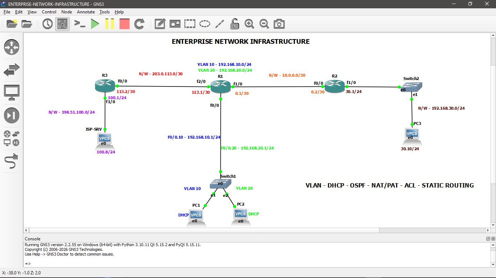
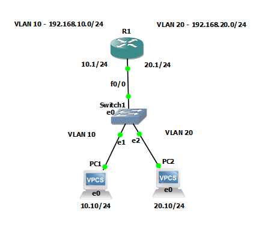
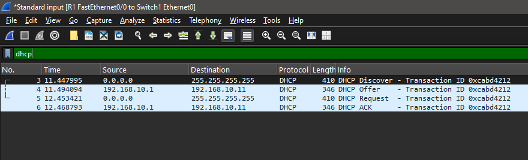

# Enterprise Network Infrastructure

A multi-router enterprise network designed, configured, tested, and analyzed using **GNS3, Cisco IOS, and Wireshark**.

The project demonstrates practical implementation of **VLANs, inter-VLAN routing, DHCP, OSPF, static routing, NAT/PAT, ACLs, IPv4 subnetting, and packet-level network analysis**.

---

## Project Overview

This project simulates a small enterprise network with multiple LAN segments, internal routing, and an external/ISP-facing network.

The network was built incrementally in GNS3 and validated using Cisco IOS commands, end-to-end connectivity tests, and Wireshark packet captures.

### Key Technologies

- VLANs and 802.1Q trunking
- Inter-VLAN routing
- DHCP
- IPv4 addressing and subnetting
- OSPF
- Static routing
- NAT/PAT
- Extended ACLs
- ARP
- ICMP
- Wireshark packet analysis
- Cisco IOS configuration and troubleshooting

---

## Network Topology



### Network Components

| Device | Role |
|---|---|
| R1 | Core/Edge Router |
| R2 | Internal Router |
| R3 | ISP/External Network Router |
| SW1 | VLAN Switch |
| Switch2 | LAN Switch |
| PC1 | VLAN 10 Client |
| PC2 | VLAN 20 Client |
| PC3 | Internal LAN Client |
| ISP-SRV | External Network Server |

---

## IP Addressing

| Network / Link | Address |
|---|---|
| VLAN 10 | `192.168.10.0/24` |
| VLAN 20 | `192.168.20.0/24` |
| R2 LAN | `192.168.30.0/24` |
| R1-R2 | `10.0.0.0/30` |
| R1-R3 | `203.0.113.0/30` |
| R3-ISP | `198.51.100.0/24` |

### Key Interfaces

| Device | Interface | IP Address |
|---|---|---|
| R1 | F0/0.10 | `192.168.10.1/24` |
| R1 | F0/0.20 | `192.168.20.1/24` |
| R1 | F1/0 | `10.0.0.1/30` |
| R1 | F2/0 | `203.0.113.1/30` |
| R2 | F0/0 | `10.0.0.2/30` |
| R2 | F1/0 | `192.168.30.1/24` |
| R3 | F0/0 | `203.0.113.2/30` |
| R3 | F1/0 | `198.51.100.1/24` |
| ISP-SRV | — | `198.51.100.8/24` |

---

## VLAN Configuration

Two user VLANs were implemented on the main LAN.

| VLAN | Purpose | Network |
|---|---|---|
| VLAN 10 | User Network A | `192.168.10.0/24` |
| VLAN 20 | User Network B | `192.168.20.0/24` |

R1 performs inter-VLAN routing using router-on-a-stick subinterfaces.

802.1Q VLAN tagging was verified using Wireshark.



Additional VLAN evidence is available in the `screenshots/` and `wireshark/` directories.

---

## DHCP

R1 was configured as the DHCP server for the user VLANs.

Clients automatically obtained their IP configuration from the router.

The DHCP DORA process was captured and analyzed using Wireshark.



DHCP configuration and binding information are available in the `configs/` and `screenshots/` directories.

---

## OSPF Routing

OSPF Area 0 was configured between R1 and R2.

### Router IDs

- **R1** → `1.1.1.1`
- **R2** → `2.2.2.2`

The routers successfully established an OSPF adjacency and exchanged routes. The `192.168.30.0/24` network was learned dynamically by R1 through OSPF.

The OSPF packet capture is available at:  
`wireshark/ospf.pcapng`

---

## Static Routing

Static routing was configured where required to provide connectivity toward the external network.

R1 uses R3 as the next hop for external traffic:
- `0.0.0.0/0` → `203.0.113.2`

The external network is: `198.51.100.0/24`

---

## NAT/PAT

NAT overload was configured on R1 to translate internal private IP addresses when communicating with the external network.

### Inside Networks
- `192.168.10.0/24`
- `192.168.20.0/24`

### Outside Interface
- R1 `F2/0` (`203.0.113.1/30`)

NAT translations were verified using Cisco IOS commands and packet captures.

The NAT Wireshark capture is available at:  
`wireshark/nat.pcapng`

---

## Access Control List

An extended ACL was implemented on VLAN 20 to demonstrate traffic filtering between VLANs.

The objective was to prevent VLAN 20 clients from initiating ICMP echo requests toward VLAN 10 while allowing return traffic and other IP traffic.

### Test Results

| Test | Result |
|---|---|
| VLAN 20 → VLAN 10 ICMP | Blocked |
| VLAN 10 → VLAN 20 ICMP | Allowed |
| VLAN 20 → External Network | Allowed |

ACL hit counters were verified using Cisco IOS.

---

## ARP Analysis

ARP traffic was captured and analyzed to understand local IP-to-MAC address resolution.

The capture demonstrates:
- ARP Request
- ARP Reply
- MAC address resolution
- Subsequent IP communication

The ARP Wireshark capture is available at:  
`wireshark/arp.pcapng`

---

## Packet Analysis

Wireshark was used throughout the project to validate network behavior at the packet level.

Protocols analyzed include:
- ARP
- ICMP
- DHCP
- OSPF
- 802.1Q
- NAT-related traffic

Packet captures are available in: `wireshark/`

---

## Verification

The network was verified using Cisco IOS commands and end-to-end connectivity testing.

### Verification Commands

- `show ip interface brief`
- `show ip route`
- `show ip ospf neighbor`
- `show ip ospf database`
- `show ip dhcp binding`
- `show access-lists`
- `show ip nat translations`
- `ping`
- `traceroute`

### Connectivity Tests

Successful connectivity was verified between:
- VLAN 10 clients and their gateway
- VLAN 20 clients and their gateway
- Internal networks through R1 and R2
- Internal clients and the external ISP server
- R1 and R3 across the WAN link

ACL behavior was also verified using both successful and blocked ICMP tests.

---

## Troubleshooting

The project involved practical troubleshooting of:
- VLAN connectivity
- Inter-VLAN routing
- OSPF adjacency
- Route propagation
- Static routing
- NAT translation
- ACL behavior
- End-to-end connectivity

The network was validated incrementally after each major configuration stage.

---

## Project Structure

```text
enterprise-network-infrastructure/
│
├── README.md
│
├── screenshots/
│   ├── topo-final.png
│   ├── vlan.png
│   ├── vlan10.png
│   ├── vlan20.png
│   ├── dhcp.png
│   ├── dhcp-bind.png
│   ├── ospf.png
│   ├── acl.png
│   └── nat.png
│
├── configs/
│   ├── r1-vlan.txt
│   ├── r1-dhcp.txt
│   ├── r1-ospf.txt
│   ├── r2-ospf.txt
│   ├── r1-acl.txt
│   └── r1-route.txt
│
├── wireshark/
│   ├── arp.pcapng
│   ├── vlan.pcapng
│   ├── dhcp.pcapng
│   ├── ospf.pcapng
│   └── nat.pcapng
│
└── documentation/
```

## Skills Demonstrated
- IPv4 addressing
- Subnetting
- VLANs
- 802.1Q
- Inter-VLAN routing
- DHCP
- OSPF
- Static routing
- NAT/PAT
- ACLs
- WAN connectivity

## Network Analysis
- Wireshark
- Packet capture
- Protocol analysis
- ARP analysis
- DHCP DORA analysis
- OSPF packet analysis
- ICMP troubleshooting
- NAT traffic analysis

## Tools
- GNS3
- Cisco IOS
- Wireshark

Project Outcome
This project demonstrates the design, implementation, verification, and troubleshooting of a multi-router enterprise network.

The configuration was validated through Cisco IOS command-line verification, end-to-end connectivity testing, and Wireshark packet analysis.

Author
Asim Akram Khan K

B.Tech — Electronics and Communication Engineering

Interests: Networking | Network Security | Cloud Networking | Infrastructure
